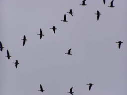
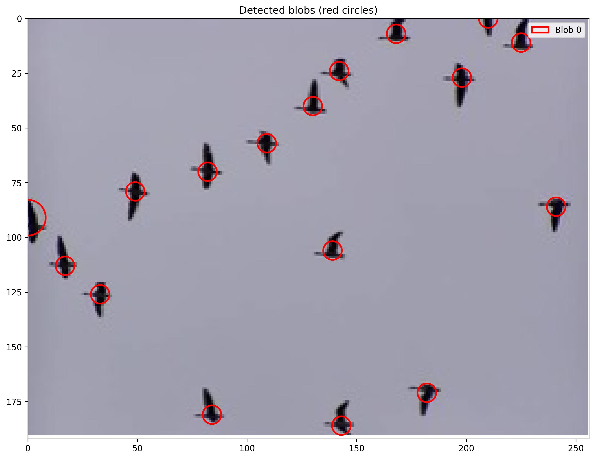
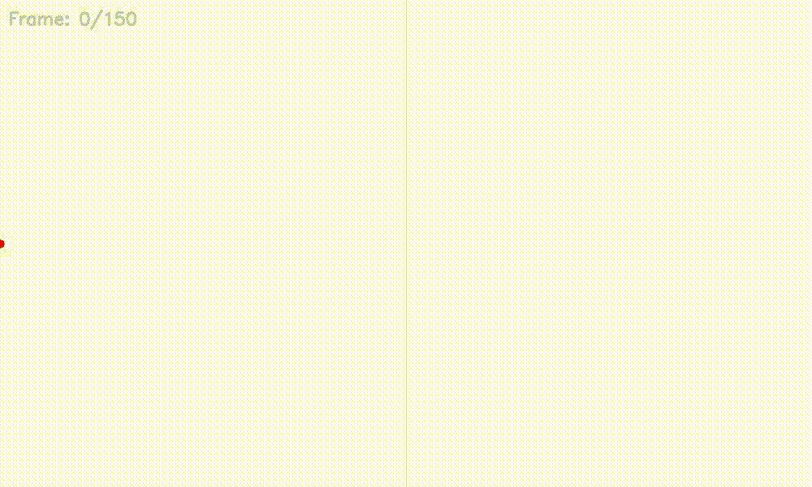
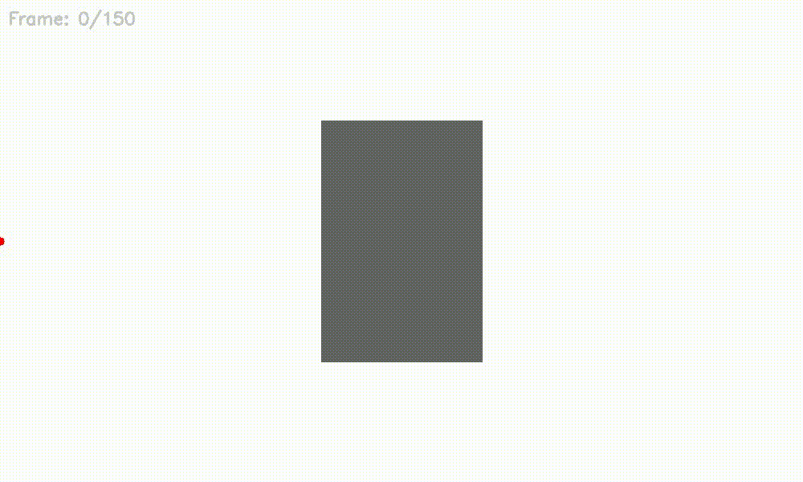
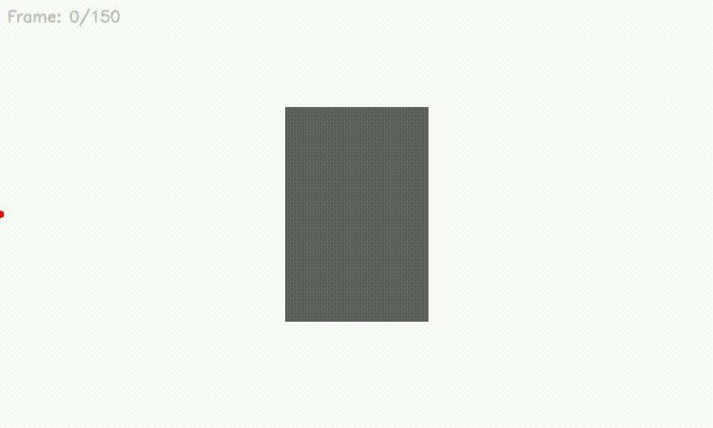

# blob detection and tracking library

[](https://github.com/Astronomax/blob-detection-and-tracking/actions/workflows/ci.yml)


A high-performance C++/Python library for blob detection using FFT-accelerated Laplacian of Gaussian convolution, with robust tracking via Hungarian algorithm matching and Kalman filter prediction.

Detection Engine
- FFT-accelerated Laplacian of Gaussian for efficient blob detection
- Multi-scale approach with adaptive thresholding
- Optimized C++ core with Python bindings

Tracking System
- Hungarian algorithm for optimal object matching
- Kalman Filter integration for motion prediction
- Occlusion handling and trajectory smoothing

<div style="display: flex; justify-content: space-between; margin-bottom: 30px;">
  
  
</div>

<div style="margin: 10px 0;"></div>

<div style="display: flex; justify-content: space-between; margin-bottom: 30px;">
  
  
</div>

<div style="margin: 10px 0;"></div>

<div style="display: flex; justify-content: space-between; margin-bottom: 30px;">
  
  
</div>

## Installation

```bash
# c++
mkdir build && cd build
cmake .. && make
```
```bash
# python
python3 setup.py bdist_wheel
pip install dist/blob-0.1.0-<...>.whl
```

## Usage

```c++
// c++
#include "blob_detector.hpp"
#include "blob_tracker.hpp"

int main() {
    blobs::matrix<float> image(300, 400); // Your image
    
    // Detect blobs
    auto blobs = blobs::blob_detector<float, blobs::conv_method::AUTO>::detect_blobs(
        image, 1.0f, 6.0f, 5, 0.35f, 0.1f, true);
    
    // Track objects
    blobs::blob_tracker tracker(true, true, 10);
    auto tracked = tracker.track(blobs, 1000.0, 1.5);
    
    return 0;
}
```

```python
# python
import numpy as np
from blob import detect_blobs, ConvMethod, BlobTracker, ObjectStatus

# Detect blobs
blobs = detect_blobs(
    image=np.random.rand(300,400), # Your image
    min_sigma=1.0,
    max_sigma=6.0,
    num_sigma=5,
    threshold_abs=0.35,
    overlap=0.1,
    method=ConvMethod.AUTO
)

# Track objects
tracker = BlobTracker(use_prediction=True, use_ttl=True, ttl=10)
tracked = tracker.track(blobs, 1000.0, 1.5)
```
